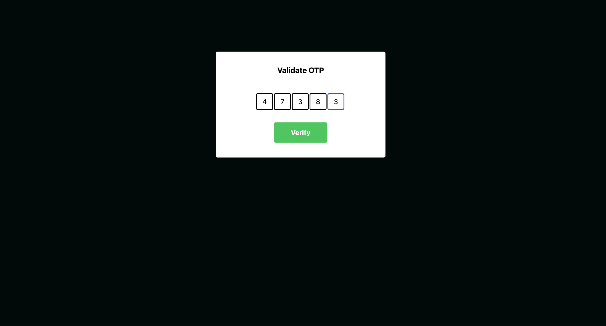

# 🔐 OTP Input Component (React + Tailwind CSS)

A responsive and accessible OTP (One-Time Password) input component built with **React** and styled using **Tailwind CSS**. It allows users to input a multi-digit OTP (e.g., 5 digits) with auto-focus, numeric-only input, and backspace navigation.

## ✨ Features

- ⚡ Auto-focus on next input after typing
- 🔙 Backspace to go to previous input
- 🔢 Restricts input to digits only
- 🧠 Manages state using React `useState`
- 📦 Uses `useRef` to programmatically control input focus
- 🎨 Responsive UI styled with Tailwind CSS

## 📸 Preview



## 🧩 Tech Stack

- React (Functional Component)
- Tailwind CSS
- JavaScript (ES6+)

## 📁 Component Code

```jsx
import React, { useEffect, useRef, useState } from "react";

const OtpCount = 5;

function Otp() {
  const [inputArr, setInputArr] = useState(new Array(OtpCount).fill(""));
  const refArr = useRef([]);

  useEffect(() => {
    refArr.current[0]?.focus();
  }, []);

  const handleOnChange = (value, index) => {
    // Block non-numeric input
    if (isNaN(value)) return;

    const newValue = value.trim(); // Remove spaces
    const newArr = [...inputArr]; // Clone current state
    newArr[index] = newValue.slice(-1); // Only take the last digit typed
    setInputArr(newArr); // Update state
    // Move focus to next input box if a value was entered
    newValue && refArr.current[index + 1]?.focus();
  };
    // If user presses Backspace and the current input is empty, move focus to the previous input
  const handleOnKeyDown = (e, index) => {
    if (e.key === "Backspace" && inputArr[index] === "") {
      refArr.current[index - 1]?.focus();
    }
  };

  return (
    <div className="bg-[#000a09] w-screen h-screen">
      <div className="flex justify-center">
        <div className="w-[400px] h-[250px] bg-[#fff] mt-[130px] drop-shadow-lg rounded">
          <span className="flex justify-center items-center mt-[30px] font-bold text-lg">
            Validate OTP
          </span>
          <div className="flex justify-center items-center mt-[40px]">
            {inputArr.map((input, index) => (
              <input
                key={index}
                ref={(el) => (refArr.current[index] = el)}
                className="border-2 w-[40px] h-[40px] text-center mr-0.5 text-black rounded"
                type="text"
                value={input}
                onChange={(e) => handleOnChange(e.target.value, index)}
                onKeyDown={(e) => handleOnKeyDown(e, index)}
              />
            ))}
          </div>
          <div className="flex justify-center items-center mt-[25px]">
            <button className="rounded-lg px-10 border-4 bg-green-500 text-white py-3 font-bold cursor-pointer">
              Verify
            </button>
          </div>
        </div>
      </div>
    </div>
  );
}

export default Otp;